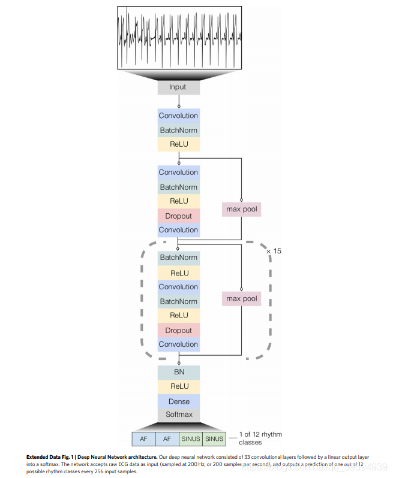

# 吴恩达心电图识别DNN实现 Pytorch

## 模型介绍

该深度卷积神经网络以原始心电图数据（以200Hz或每秒200个样本为样本）作为输入，并且每256个样本（或每1.28秒）生成一个预测，称之为输出间隔。网络仅以原始心电图样本为输入，网络架构有34层(conv),采用类似残差网络的架构进行快捷连接。

该网络由16个残差块组成，每个块有两个卷积层。卷积层核为16，过滤器个数为32∗2^K，其中K是超参，从0开始，每四个残差块增加一个。每个残差块对其输入进行下采样2次。

在每个卷积层之前，应用BN和ReLU，采用预激活块设计。由于这种预激活块结构，网络的第一层和最后一层是特殊的。另外还在卷积层之间和非线性之后应用Dropout，概率为0.2。最终完全连接的softmax层输出12类心率时长的概率。

网络是从头训练的，随机初始化权重。使用Adam optimizer，默认参数为β1= 0.9，β2= 0.999，minibatch大小为128。学习率初始化为1×10-3，并且当连续两个epoch的训练损失没有改观时其降低10倍。通过grid search和手动调整的组合来选择网络架构和优化算法的超参数。

对于该体系结构，主要搜索的超参数与为卷积层的数量，卷积滤波器的大小和数量，以及残差连接的使用。实验中发现，一旦模型的深度超过八层，残差连接就很有用。论文还尝试了RNN，包括LSTM和BiRNN，但发现准确性没有提高，运行时间却大幅增加;因此，因此文章抛弃了这类模型。

参考：https://blog.csdn.net/qq_39594939/article/details/114308617



[源代码keras实现][https://github.com/awni/ecg/tree/c97bb96721c128fe5aa26a092c7c33867f283997/ecg]，我用pytorch写的，由于我的输入序列长度为189，改了一些，比如卷积核改为3，残差块x5，连续残差块中每隔一个残差块增加一下通道数

```bash
----------------------------------------------------------------
        Layer (type)               Output Shape         Param #
================================================================
            Conv1d-1              [-1, 32, 189]              96
       BatchNorm1d-2              [-1, 32, 189]              64
              ReLU-3              [-1, 32, 189]               0
            Conv1d-4              [-1, 32, 189]           3,072
       BatchNorm1d-5              [-1, 32, 189]              64
              ReLU-6              [-1, 32, 189]               0
           Dropout-7              [-1, 32, 189]               0
            Conv1d-8               [-1, 32, 95]           3,104
         MaxPool1d-9               [-1, 32, 95]               0
       head_block-10               [-1, 32, 95]               0
      BatchNorm1d-11               [-1, 32, 95]              64
             ReLU-12               [-1, 32, 95]               0
           Conv1d-13               [-1, 32, 95]           3,072
      BatchNorm1d-14               [-1, 32, 95]              64
             ReLU-15               [-1, 32, 95]               0
          Dropout-16               [-1, 32, 95]               0
           Conv1d-17               [-1, 32, 48]           3,104
      BatchNorm1d-18               [-1, 32, 48]              64
             ReLU-19               [-1, 32, 48]               0
           Conv1d-20               [-1, 32, 48]           3,072
      BatchNorm1d-21               [-1, 32, 48]              64
             ReLU-22               [-1, 32, 48]               0
          Dropout-23               [-1, 32, 48]               0
           Conv1d-24               [-1, 64, 24]           6,208
      BatchNorm1d-25               [-1, 64, 24]             128
             ReLU-26               [-1, 64, 24]               0
           Conv1d-27               [-1, 64, 24]          12,288
      BatchNorm1d-28               [-1, 64, 24]             128
             ReLU-29               [-1, 64, 24]               0
          Dropout-30               [-1, 64, 24]               0
           Conv1d-31               [-1, 64, 12]          12,352
      BatchNorm1d-32               [-1, 64, 12]             128
             ReLU-33               [-1, 64, 12]               0
           Conv1d-34               [-1, 64, 12]          12,288
      BatchNorm1d-35               [-1, 64, 12]             128
             ReLU-36               [-1, 64, 12]               0
          Dropout-37               [-1, 64, 12]               0
           Conv1d-38               [-1, 128, 6]          24,704
      BatchNorm1d-39               [-1, 128, 6]             256
             ReLU-40               [-1, 128, 6]               0
           Conv1d-41               [-1, 128, 6]          49,152
      BatchNorm1d-42               [-1, 128, 6]             256
             ReLU-43               [-1, 128, 6]               0
          Dropout-44               [-1, 128, 6]               0
           Conv1d-45               [-1, 128, 3]          49,280
   backbone_block-46               [-1, 128, 3]               0
      BatchNorm1d-47               [-1, 128, 3]             256
             ReLU-48               [-1, 128, 3]               0
          Flatten-49                  [-1, 384]               0
           Linear-50                  [-1, 128]          49,280
           Linear-51                   [-1, 64]           8,256
           Linear-52                   [-1, 32]           2,080
           Linear-53                   [-1, 16]             528
           Linear-54                    [-1, 2]              34
      dense_block-55                    [-1, 2]               0
================================================================
Total params: 243,634
Trainable params: 243,634
Non-trainable params: 0
----------------------------------------------------------------
Input size (MB): 0.00
Forward/backward pass size (MB): 0.79
Params size (MB): 0.93
Estimated Total Size (MB): 1.72
----------------------------------------------------------------
```

